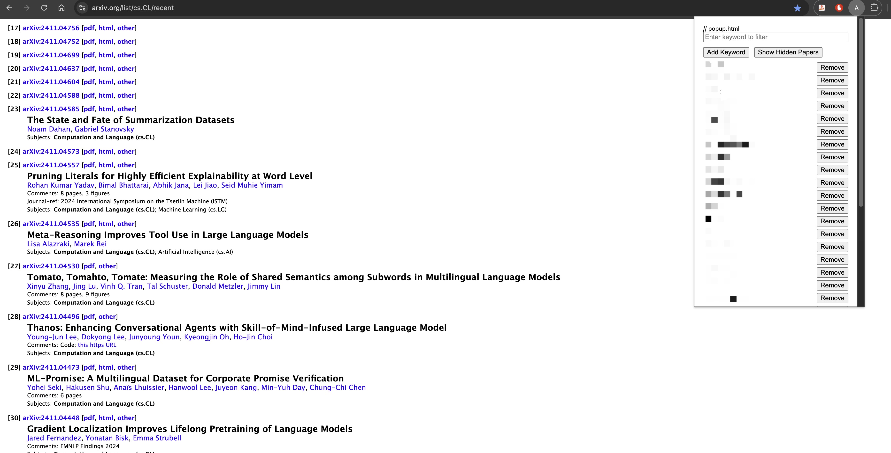

## ArxivFocus
A Chrome extension to help quickly go through arxiv papers by allowing hiding papers containing specific keywords 

### How to Use?

To use this extension:

* Create a new directory and save all the files with their respective names

* Open Chrome and go to chrome://extensions/
* Enable "Developer mode" in the top right
* Click "Load unpacked" and select your extension directory
